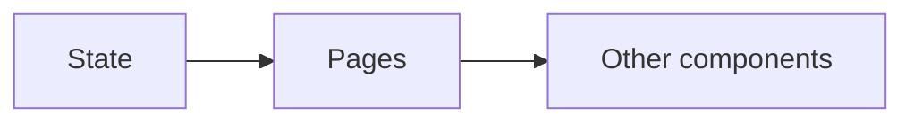

# Express Blog Front-end

This is a part of an assignment from The Odin Project (top). The assignment was to build a backend API with two different front-ends, on for the end-user (blog reader) and one for the admin (the blog writer).

This specific repository is for the end user front-end. Here are the repositories for the backend API and the admin front end:

- [Backend REST API](https://github.com/aslanhudajev/express-blog-api)
- [Administrator Front-end](https://github.com/aslanhudajev/express-blog-dashboard)

## Built with

- Vite
- React
- Axios
- React Router
- Tanstack Query
- ShadCN
- Tailwind
- ...and more

## Features

A React front-end built with ShadCN components. React Router is used for SPA path navigation. Tanstack Query is used to fetch data from the API and its states `isError`, `isLoading` and `data` are used to display loading components. Highly recommend using Tanstack Query.

This front-end only lets you read posts.

## State

My general way of managing state was very simple for this site.
The general idea was this:

So basically, all state is held in the `Page` components, and passed downward into each `Page`´s children.

No state management library was used. I only used `useState` and `useRef`.
